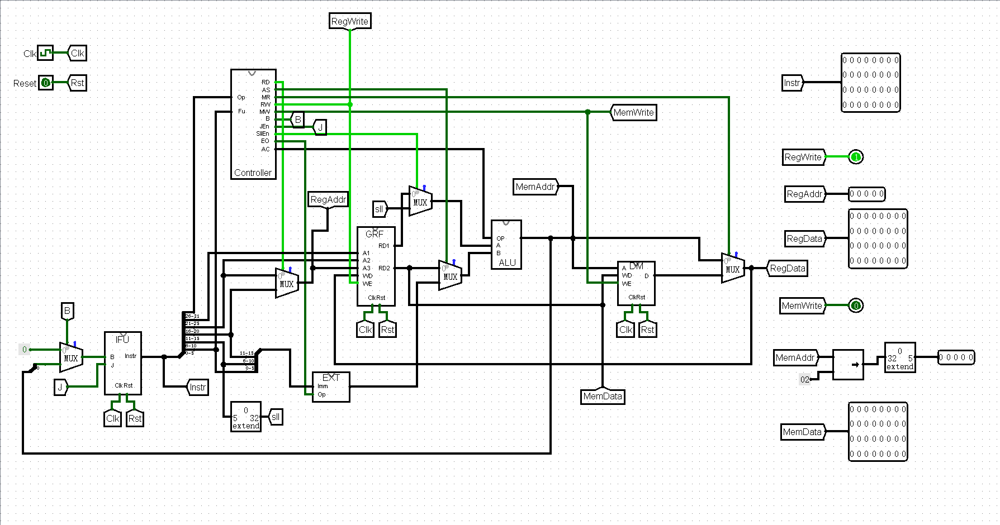
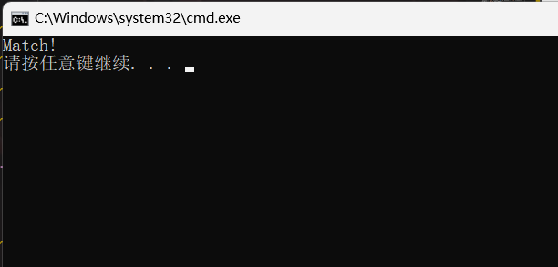

# 设计文档

## 设计草稿

#### 模块规格

1. **IFU（取指令单元）**

|端口|方向|位宽|功能|
|:----:|:----:|:----:|----|
|Clk|I|1|时钟信号输入|
|Reset|I|1|异步复位信号，当为1时将其中PC寄存器清零|
|Branch|I|1|beq、bne等指令跳转信号，为1时跳转|
|J|I|1|j跳转指令信号，为1时跳转|
|Jr|I|1|jr指令跳转信号|
|A|I|32|jr跳转的目标地址|
|Instr|O|32|32位指令信号输出|
|NPC|O|32|下一条指令地址|

内部设计

用一个状态机实现，状态转移为NPC模块，状态存储为PC寄存器，IM为输出逻辑

**NPC**

|端口|方向|位宽|功能|
|:----:|:----:|:----:|----|
|B|I|1|beq、bne等指令跳转信号，为1时跳转|
|BO|I|32|beq、bne等指令跳转偏移量，Branch为1时有效，偏移量先符号扩展为32位再左移2位|
|J|I|1|j指令跳转信号|
|index|I|26|j指令跳转索引|
|Jr|I|1|jr指令跳转信号|
|A|I|32|jr指令跳转地址|
|PC|I|32|上一次PC的值|
|NPC|O|32|下一次PC的值|

**IM**

|端口|方向|位宽|功能|
|:----:|:----:|:----:|----|
|PC|I|32|所取指令的地址|
|Instr|O|32|取出的指令|
内部采用ROM实现，因为PC表示的地址为32位，转换为字地址为30位，但IM字地址只有5位，当出现不合法地址时将始终输出0

1. **Controller（控制器）**

|端口|方向|位宽|功能|
|:----:|:----:|:----:|----|
|OpCode|I|6|操作码输入|
|Func|I|6|R型指令功能码|
|RegDst|O|1|为1时写入rd，否则写入rt|
|ALUSrc|O|1|为1时将立即数送至ALU，为0时将寄存器中数送至ALU|
|MemtoReg|O|1|为1时将内存中的值写入寄存器|
|RegWrite|O|1|为1时需要对寄存器做写操作|
|MemWrite|O|1|为1时需要向内存写入数据|
|Branch|O|1|为1时为beq、bne等指令的跳转|
|JEn|O|1|为1时为j指令跳转|
|SllEn|O|1|为1时为sll指令|
|ExtOp|O|1|为1时对I型指令进行有符号扩展，为0时进行无符号扩展|
|ALUctr|O|4|2'b0000为与运算，2'b0001时为或运算，</br>2'b0010时做加运算，2'b0011为非A与B</br>2'b0100为A与非B，2'b0101为加载至高位，</br>2'b0110时做减运算</br>2'b0111时为是否相等，相等时输出32'b1</br>2'b1000为`A<<B`左移运算，2'b1001为`A<B`时赋1</br>2'b1010为`A>B`时赋1，2'b1011为`B<<A`左移运算| 
|Jal|O|1|为1时表示jal跳转信号|
|Jr|O|1|为1时表示jr跳转信号|

内部设计

分为R型译码，I型译码和J型译码三个部分，他们将对应的指令端口赋1，Countroller主电路中选择R，I，J三个模块哪个使能

**R型译码**

|端口|方向|位宽|功能|
|:----:|:----:|:----:|----|
|Func|I|6|R型指令功能码|
|En|I|1|使能端，当为1时生效，为0时所有输出端口输出0|
|add|O|1|输出1时表示add指令|
|sub|O|1|输出1时表示sub指令|
|sll|O|1|输出1时表示sll|
|sllv|O|1|输出1时表示sllv|
|slt|O|1|输出1时为slt|
|jr|O|1|输出1时表示jr|

**I或J译码**

|端口|方向|位宽|功能|
|:----:|:----:|:----:|----|
|OpCode|I|6|操作码输入|
|En|I|1|使能端|
|ori|O|1|输出1时表示ori指令|
|lw|O|1|输出1时表示lw指令|
|sw|O|1|输出1时表示sw指令|
|beq|O|1|输出1时表示beq指令|
|lui|O|1|输出1时表示lui指令|
|addi|O|1|输出1时表示addi|
|j|O|1|输出1时表示j指令|
|jal|O|1|输出1时表示jal|
|sb|O|1|输出1时表示sb|

**或逻辑真值表**

|输入|RegDst|ALUSrc|MemtoReg|RegWrite|MemWrite|Branch|JEn|SllEn|ExtOp|ALUctr|Jal|Jr|Byte|
|:----:|:----:|:----:|:----:|:----:|:----:|:----:|:----:|:----:|:----:|:----:|:----:|:----:|:----:|
|add|1|0|0|1|0|0|0|0|x|0010|0|0|0|
|sub|1|0|0|1|0|0|0|0|x|0110|0|0|0|
|beq|x|0|x|0|0|1|0|0|x|0111|0|0|0|
|ori|0|1|0|1|0|0|0|0|0|0001|0|0|0|
|lui|0|1|0|1|0|0|0|0|0|0101|0|0|0|
|lw|0|1|1|1|0|0|0|0|1|0010|0|0|0|
|sw|x|1|x|0|1|0|0|0|1|0010|0|0|0|
|addi|0|1|0|1|0|0|0|0|1|0010|0|0|0|
|sll|1|0|0|1|0|0|0|1|0|1011|0|0|0|
|sllv|1|0|0|1|0|0|0|0|0|1011|0|0|0|
|slt|1|0|0|1|0|0|0|0|0|1001|0|0|0|
|j|0|0|0|0|0|0|1|0|0|xxxx|0|0|0|
|jal|0|0|0|1|0|0|1|0|0|xxxx|1|0|0|
|jr|0|0|0|0|0|0|0|0|0|xxxx|0|1|0|
|sb|x|1|x|0|1|0|0|0|1|0010|0|0|1|
|lb|0|1|1|1|0|0|0|0|1|0010|0|0|1|

1. **GRF（通用寄存器组）**

|端口|方向|位宽|功能|
|:----:|:----:|:----:|----|
|Clk|I|1|时钟信号|
|Reset|I|1|异步复位信号，复位后均为0|
|A1|I|5|第一个读寄存器地址|
|A2|I|5|第二个读寄存器地址|
|A3|I|5|写寄存器地址|
|WD|I|32|写入的32位数据|
|WE|I|1|写使能端，为1时，A3和WD才有效|
|RD1|O|32|第一个地址读出的32位数据|
|RD2|O|32|第二个地址读出的32位数据|

寄存器总数为32，*0号寄存器*始终为0

4. **ALU（算数逻辑运算单元）**

|端口|方向|位宽|功能|
|:----:|:----:|:----:|----|
|SrcA|I|32|第一个运算数|
|SrcB|I|32|第二个运算数|
|ALUOp|I|4|运算类型，同控制器中介绍|
|ALUResult|O|32|运算结果|

5. **DM（数据存储器）**

|端口|方向|位宽|功能|
|:----:|:----:|:----:|----|
|Clk|I|1|时钟信号输入，上升沿时可改变存储器中的值|
|A|I|32|地址输入|
|WE|I|1|写使能端，为1时可以写入数据|
|Reset|I|1|异步复位信号|
|WD|I|32|写入32位数据|
|Byte|I|1|按字节读写|
|D|O|32|读出数据|
使用RAM实现

1. **EXT（扩展单元）**

|端口|方向|位宽|功能|
|:----:|:----:|:----:|----|
|Imm16|I|16|16位立即数输入|
|ExtOp|I|1|为1时对imm进行有符号扩展，为0时进行无符号扩展|
|ext32|O|32|扩展为32位输出|
使用logisim内置Bit Extender，16位扩展为32位

#### 顶层设计图

  

为了更方便测试的进行，我添加了addi（不考虑溢出），sll，sllv，slt，j指令

## 思考题

1. 上面我们介绍了通过 FSM 理解单周期 CPU 的基本方法。请大家指出单周期 CPU 所用到的模块中，哪些发挥状态存储功能，哪些发挥状态转移功能。

>答：PC寄存器和GRF发挥状态存储的功能。在Splitter的上游，由NPC模块实现PC的更新，即状态的转移；在Splitter的下游，主要由Controller控制GRF中寄存器的更新，ALU更新新的状态，所以Controller和ALU都发挥状态转移功能。

2. 现在我们的模块中 IM 使用 ROM， DM 使用 RAM， GRF 使用 Register，这种做法合理吗？ 请给出分析，若有改进意见也请一并给出。

>答：合理，因为IM中有些的指令需要在断电后依然保持，如Bios，不然CPU无法工作。DM使用RAM是因为我们需要经常对内存进行读写，ROM只读，即使为可读的ROM，读写速度也慢于RAM，而寄存器价格昂贵，且不适合大量集成，所以选择RAM最佳。GRF是CPU运行中需要存储的一些临时变量，并且几乎所有的指令都要使用到GRF，所以选用读写速度最快的寄存器构成。

3. 在上述提示的模块之外，你是否在实际实现时设计了其他的模块？如果是的话，请给出介绍和设计的思路。

>答：在IFU内部设计了NPC模块，利用当前PC值和B指令和J指令信号计算出下一次的PC值。

4. 事实上，实现`nop`空指令，我们并不需要将它加入控制信号真值表，为什么？

>答：在未添加sll指令之前，因为nop的不在控制信号真值表中，所以读到nop指令时所有控制信号输出都为0，没有任何元件被驱动，所以也不产生任何效果。添加sll指令后，nop被当成sll $0,$0,0执行，所以也不产生任何效果。

5. 上文提到，MARS 不能导出 PC 与 DM 起始地址均为 0 的机器码。实际上，可以避免手工修改的麻烦。请查阅相关资料进行了解，并阐释为了解决这个问题，你最终采用的方法。

>答：当MARS的DM起始地址选为0时，代码段起始地址为0x00003000，所以使用绝对地址跳转指令，如j在跳转前将其地址减去一个0x00003000即可。

6. 阅读 Pre 的 “MIPS 指令集及汇编语言” 一节中给出的测试样例，评价其强度（可从各个指令的覆盖情况，单一指令各种行为的覆盖情况等方面分析），并指出具体的不足之处。

>答：测试没有涉及所有寄存器，所以如果其中一个发生故障无法发现；测试的数据量较少；读取指令没有测试offset为负的情况；beq跳转指令只有向后跳转，没有向前跳转。

## 测试程序

**指令功能测试**

将IM和DM中的ROM和RAM都扩展为1024*32

为避免手打的麻烦，我决定使用C语言生成Mars代码

```C
#include <stdio.h>
#include <math.h>
#include <string.h>
#include <ctype.h>
#include <stdlib.h>
#include <time.h>
int main()
{

    int i;
    int ret;
    srand((unsigned)time(NULL));
    for(i=0;i<32;i++)
    {
        ret = rand();
        ret = (ret % 65536) - 8192;
        if(i!=8)
        {
            printf("addi $%d,$0,%d\n",i,ret);
            printf("sll $t2,$t0,2\n");
            printf("sw $%d,arry($t2)\n",i);
            printf("addi $t0,$t0,1\n");
        }
    }
}
```

此程序可以生成随机数，并测试0~31每个寄存器，并且可以多次运行，重复测试。

mips测试代码

```mips

.data
arry:.space 4096

.text
#寄存器功能测试
addi $t0,$0,0#i=0
addi $0,$0,15602
sll $t2,$t0,2
sw $0,arry($t2)
addi $t0,$t0,1
addi $1,$0,8948
sll $t2,$t0,2
addi $t2,$t2,1
sw $1,-1($t2)
addi $t2,$t2,-1
addi $t0,$t0,1
addi $2,$0,9242
sll $t2,$t0,2
sw $2,arry($t2)
addi $t0,$t0,1
addi $3,$0,17432
sll $t2,$t0,2
sw $3,arry($t2)
addi $t0,$t0,1
addi $4,$0,764
sll $t2,$t0,2
sw $4,arry($t2)
addi $t0,$t0,1
addi $5,$0,3621
sll $t2,$t0,2
sw $5,arry($t2)
addi $t0,$t0,1
addi $6,$0,-6179
sll $t2,$t0,2
sw $6,arry($t2)
addi $t0,$t0,1
addi $7,$0,12560
sll $t2,$t0,2
sw $7,arry($t2)
addi $t0,$t0,1
addi $9,$0,-2518
sll $t2,$t0,2
sw $9,arry($t2)
addi $t0,$t0,1
addi $10,$0,-6986
sll $t2,$t0,2
sw $10,arry($t2)
addi $t0,$t0,1
addi $11,$0,-2042
sll $t2,$t0,2
sw $11,arry($t2)
addi $t0,$t0,1
addi $12,$0,6251
sll $t2,$t0,2
sw $12,arry($t2)
addi $t0,$t0,1
addi $13,$0,687
sll $t2,$t0,2
sw $13,arry($t2)
addi $t0,$t0,1
addi $14,$0,4663
sll $t2,$t0,2
sw $14,arry($t2)
addi $t0,$t0,1
addi $15,$0,9879
sll $t2,$t0,2
sw $15,arry($t2)
addi $t0,$t0,1
addi $16,$0,22207
sll $t2,$t0,2
sw $16,arry($t2)
addi $t0,$t0,1
addi $17,$0,7133
sll $t2,$t0,2
sw $17,arry($t2)
addi $t0,$t0,1
addi $18,$0,13170
sll $t2,$t0,2
sw $18,arry($t2)
addi $t0,$t0,1
addi $19,$0,16602
sll $t2,$t0,2
sw $19,arry($t2)
addi $t0,$t0,1
addi $20,$0,16729
sll $t2,$t0,2
sw $20,arry($t2)
addi $t0,$t0,1
addi $21,$0,5664
sll $t2,$t0,2
sw $21,arry($t2)
addi $t0,$t0,1
addi $22,$0,-7248
sll $t2,$t0,2
sw $22,arry($t2)
addi $t0,$t0,1
addi $23,$0,-5308
sll $t2,$t0,2
sw $23,arry($t2)
addi $t0,$t0,1
addi $24,$0,18414
sll $t2,$t0,2
sw $24,arry($t2)
addi $t0,$t0,1
addi $25,$0,19246
sll $t2,$t0,2
sw $25,arry($t2)
addi $t0,$t0,1
addi $26,$0,23398
sll $t2,$t0,2
sw $26,arry($t2)
addi $t0,$t0,1
addi $27,$0,-5175
sll $t2,$t0,2
sw $27,arry($t2)
addi $t0,$t0,1
addi $28,$0,2733
sll $t2,$t0,2
sw $28,arry($t2)
addi $t0,$t0,1
addi $29,$0,17477
sll $t2,$t0,2
sw $29,arry($t2)
addi $t0,$t0,1
addi $30,$0,356
sll $t2,$t0,2
sw $30,arry($t2)
addi $t0,$t0,1
addi $31,$0,17988
sll $t2,$t0,2
sw $31,arry($t2)
addi $t0,$t0,1
jal next

#指令测试
addi $s3,$0,0
end:
addi $t1,$0,1
add $s3,$s3,$t1
sll $t2,$t0,2
lui $1,0x00008f6f
ori $t3,$1,0x0000f3f9
sw $t3,arry($t2)
addi $t2,$t2,1
sb $s3,arry($t2)
addi $t2,$t2,1
addi $t0,$t0,1
lb $t3,arry($t2)
sll $t2,$t0,2
sw $t3,arry($t2)
addi $t0,$t0,1
beq $t1,$s3,end
j exit

next:
addi $s0,$0,990
addi $s1,$0,1
addi $t1,$0,0
addi $s2,$0,2
loop_1_begin:
    slt $t4,$t0,$s0
    beq $t4,$0,loop_1_end
    sll $t2,$t0,2
    lui $1,0x0000ffff
    ori $t3,$1,0x0000ffff
    sw $t3,arry($t2)
    add $t0,$t0,$s1
    sllv $t2,$t0,$s2
    sub $t3,$t2,$s1
    sw $t3,arry($t2)
    addi $t0,$t0,1
    j loop_1_begin
loop_1_end:
jr $ra
exit:
```

先在Mars中运行程序，将内存段导出为out.txt。将代码段导出到ROM中，运行CPU，将得到的RAM中结果保存在result.txt中

使用C语言判断结果是否相等，注意logisim导出的文件开头有v2.0 raw，需要删去，另外其没有前导0，而Mars导出的16进制数有前导0。

```C
#include <stdio.h>
#include <math.h>
#include <string.h>
#include <stdlib.h>
int main()
{
    FILE *out=fopen("out.txt","r");
    FILE *result=fopen("result.txt","r");
    char s1[100],s2[100];
    int i,j,flag;
    while(~fscanf(out,"%s",s1))
    {
        flag=0;
        fscanf(result,"%s",s2);
        for(i=0,j=0;i<strlen(s1);i++)
        {
            if(s1[i]!='0')//除去前导0
            flag=1;
            if(flag==1)
            {
                if(s1[i]==s2[j])
                j++;
                else
                break;
            }
        }
        if(i!=strlen(s1))
        {
            printf("Not match");
            return 0;
        }
    }
    printf("Match!");
    return 0;
}
```

运行结果

  


