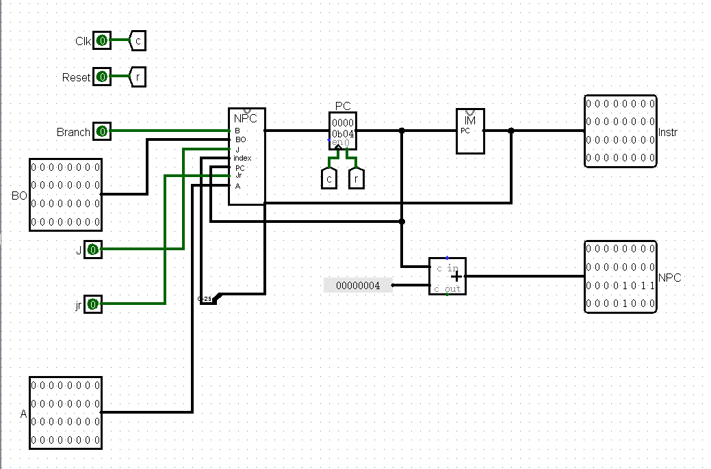
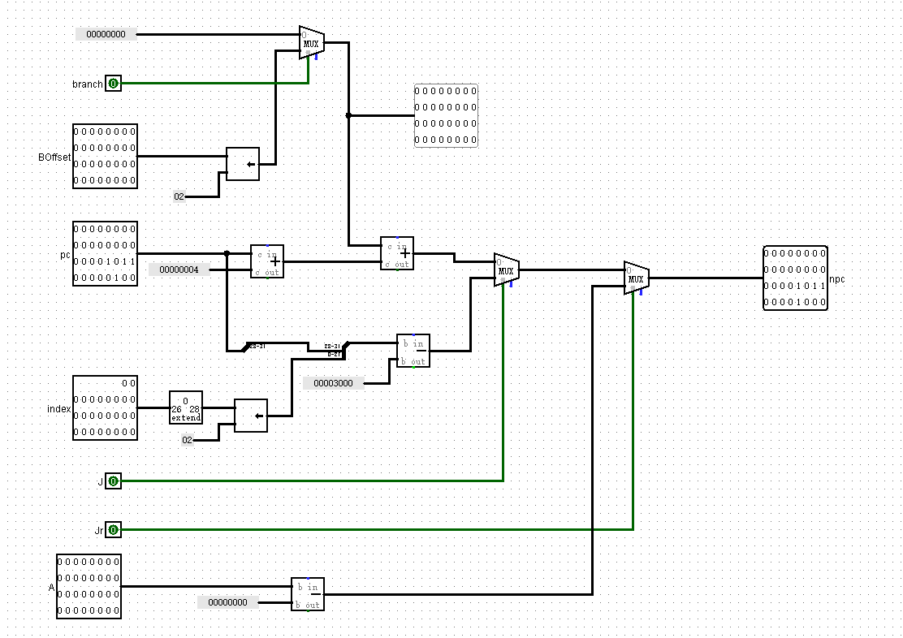
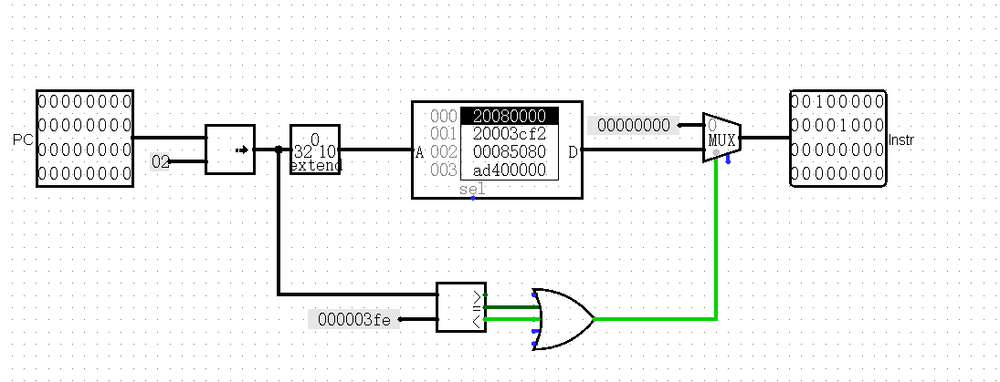
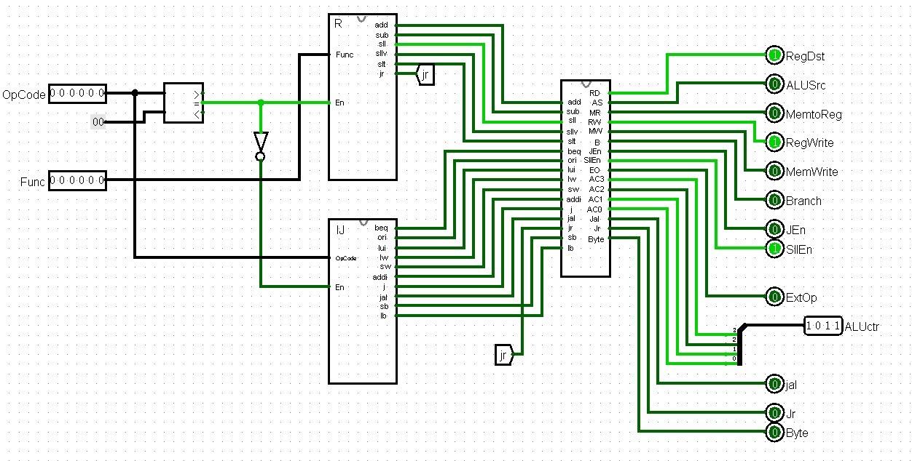
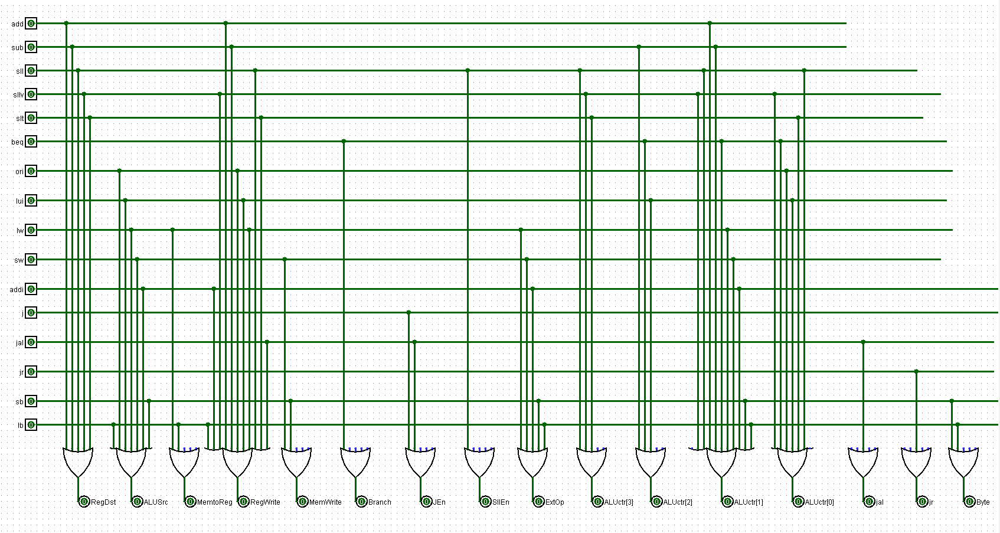
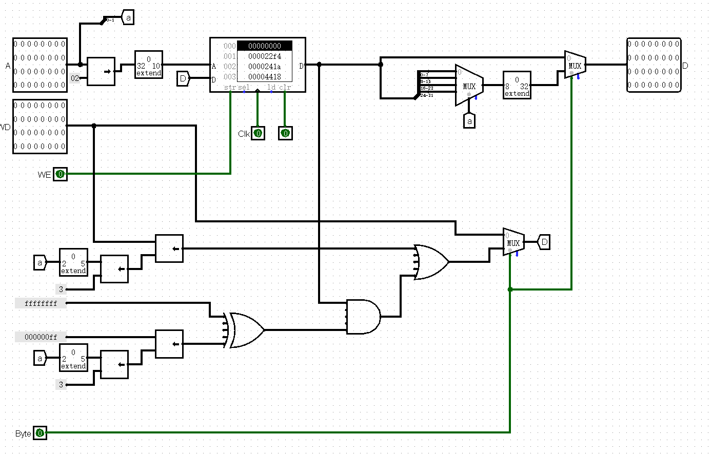
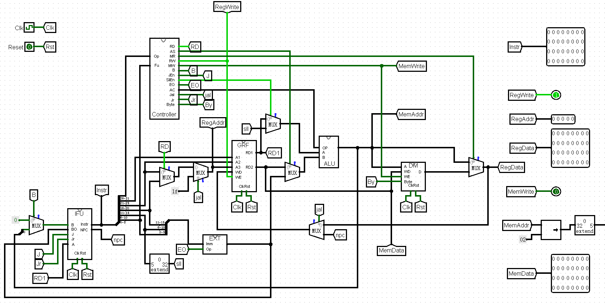
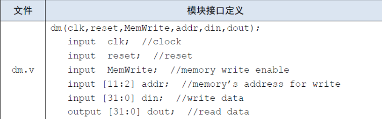

# CPU设计草稿

## 模块设计

### IFU.v

封装后端口定义

|端口|方向|位宽|功能|
|:----:|:----:|:----:|----|
|Clk|I|1|时钟信号输入|
|Reset|I|1|同步复位信号，当为1时将其中PC寄存器赋值为0x00003000|
|Branch|I|1|beq、bne等指令跳转信号，为1时跳转|
|Offset|I|32|beq、bne等指令跳转信号跳转偏移量|
|J|I|1|j跳转指令信号，为1时跳转|
|Jr|I|1|jr指令跳转信号|
|A|I|32|jr跳转的目标地址|
|Instr|O|32|32位指令信号输出|
|PC4|O|32|当前指令地址加4的值，用于jal指令存储|
|PC|O|32|当前PC|

由NPC和IM两个模块组成，NPC用于计算下一条指令地址，IM为指令存储器，为了测试的方便，增加一个PC输出端，输出当前指令的地址
  
**NPC.v**

|端口|方向|位宽|功能|
|:----:|:----:|:----:|----|
|B|I|1|beq、bne等指令跳转信号，为1时跳转|
|Offset|I|32|beq、bne等指令跳转偏移量，Branch为1时有效，偏移量左移2位|
|J|I|1|j指令跳转信号|
|Index|I|26|j指令跳转索引|
|Jr|I|1|jr指令跳转信号|
|A|I|32|jr指令跳转地址|
|PC|I|32|上一次PC的值|
|NPC|O|32|下一次PC的值|
参考logisim电路

  
**IM.v**

|端口|方向|位宽|功能|
|:----:|:----:|:----:|----|
|PC|I|32|所取指令的地址|
|Instr|O|32|取出的指令|
IM容量为32*4096，即使用reg [31:0] InstrROM[0:4096]

注意PC的起始地址为0x00003000，但ROM的地址是从0开始编码的，所以在取指令前要先将PC减去0x0003000,又因为RON使用字地址编码，所以需要右移两位

  

### Controller.v

封装后端口定义如下
|端口|方向|位宽|功能|
|:----:|:----:|:----:|----|
|OpCode|I|6|操作码输入|
|Func|I|6|R型指令功能码|
|RegDst|O|1|为1时写入rd，否则写入rt|
|ALUSrc|O|1|为1时将立即数送至ALU，为0时将寄存器中数送至ALU|
|MemtoReg|O|1|为1时将内存中的值写入寄存器|
|RegWrite|O|1|为1时需要对寄存器做写操作|
|MemWrite|O|1|为1时需要向内存写入数据|
|Branch|O|1|为1时为beq、bne等指令的跳转|
|JEn|O|1|为1时为j指令跳转|
|SllEn|O|1|为1时为sll指令|
|ExtOp|O|1|为1时对I型指令进行有符号扩展，为0时进行无符号扩展|
|ALUCtr|O|4|2'b0000为与运算，2'b0001时为或运算，</br>2'b0010时做加运算，2'b0011为非A与B</br>2'b0100为A与非B，2'b0101为加载至高位，</br>2'b0110时做减运算</br>2'b0111时为是否相等，相等时输出32'b1</br>2'b1000为`B>>A`逻辑右移运算，2'b1001为`A<B`时赋1</br>2'b1010为`A>B`时赋1，2'b1011为`B<<A`左移运算|
|Jal|O|1|为1时表示jal跳转信号|
|Jr|O|1|为1时表示jr跳转信号|
|Byte|O|1|为1时表示按字节存储|

内部包含RDecode.v，IJDecode.v和OrLogic.v中模块
  
**RDecode.v**

|端口|方向|位宽|功能|
|:----:|:----:|:----:|----|
|Func|I|6|R型指令功能码|
|En|I|1|使能端，当为1时生效，为0时所有输出端口输出0|
|add|O|1|6'b100000，输出1时表示add指令|
|sub|O|1|6'b100010，输出1时表示sub指令|
|sll|O|1|6'b000000，输出1时表示sll|
|sllv|O|1|6'b000100，输出1时表示sllv|
|slt|O|1|6'b101010，输出1时为slt|
|jr|O|1|6'b001000，输出1时表示jr|
**IJDecode.v**

|端口|方向|位宽|功能|
|:----:|:----:|:----:|----|
|OpCode|I|6|操作码输入|
|En|I|1|使能端|
|ori|O|1|6'b001101，输出1时表示ori指令|
|lw|O|1|6'b100011，输出1时表示lw指令|
|sw|O|1|6'b101011，输出1时表示sw指令|
|beq|O|1|6'b000100，输出1时表示beq指令|
|lui|O|1|6'b001111，输出1时表示lui指令|
|addi|O|1|6'b001000，输出1时表示addi|
|j|O|1|6'b000010，输出1时表示j指令|
|jal|O|1|6'b000011，输出1时表示jal|
|sb|O|1|6'b101000，输出1时表示sb|
|lb|O|1|6'b100000，输出1时表示lb|
**OrLogic.v**

逻辑真值表

|输入|RegDst|ALUSrc|MemtoReg|RegWrite|MemWrite|Branch|JEn|SllEn|ExtOp|ALUctr|Jal|Jr|Byte|
|:----:|:----:|:----:|:----:|:----:|:----:|:----:|:----:|:----:|:----:|:----:|:----:|:----:|:----:|
|add|1|0|0|1|0|0|0|0|x|0010|0|0|0|
|sub|1|0|0|1|0|0|0|0|x|0110|0|0|0|
|beq|x|0|x|0|0|1|0|0|1|0111|0|0|0|
|ori|0|1|0|1|0|0|0|0|0|0001|0|0|0|
|lui|0|1|0|1|0|0|0|0|0|0101|0|0|0|
|lw|0|1|1|1|0|0|0|0|1|0010|0|0|0|
|sw|x|1|x|0|1|0|0|0|1|0010|0|0|0|
|addi|0|1|0|1|0|0|0|0|1|0010|0|0|0|
|sll|1|0|0|1|0|0|0|1|0|1011|0|0|0|
|sllv|1|0|0|1|0|0|0|0|0|1011|0|0|0|
|slt|1|0|0|1|0|0|0|0|0|1001|0|0|0|
|j|0|0|0|0|0|0|1|0|0|xxxx|0|0|0|
|jal|0|0|0|1|0|0|1|0|0|xxxx|1|0|0|
|jr|0|0|0|0|0|0|0|0|0|xxxx|0|1|0|
|sb|x|1|x|0|1|0|0|0|1|0010|0|0|1|
|lb|0|1|1|1|0|0|0|0|1|0010|0|0|1|
  

### GRF.v

|端口|方向|位宽|功能|
|:----:|:----:|:----:|----|
|Clk|I|1|时钟信号|
|Reset|I|1|同步复位信号，复位后均为0|
|Address1|I|5|第一个读寄存器地址|
|Address2|I|5|第二个读寄存器地址|
|WriteAddress|I|5|写寄存器地址|
|WriteData|I|32|写入的32位数据|
|WriteEn|I|1|写使能端，为1时，A3和WD才有效|
|PC|I|32|PC输入|
|ReadData1|O|32|第一个地址读出的32位数据|
|ReadData2|O|32|第二个地址读出的32位数据|
使用寄存器组实现，即reg [31:0] Register [0:31]

为了测试的进行，增加一个PC的输入端

### ALU.v

|端口|方向|位宽|功能|
|:----:|:----:|:----:|----|
|SrcA|I|32|第一个运算数|
|SrcB|I|32|第二个运算数|
|ALUOp|I|4|2'b0000为与运算，2'b0001时为或运算，</br>2'b0010时做加运算，2'b0011为非A与B</br>2'b0100为A与非B，2'b0101为加载至高位，</br>2'b0110时做减运算</br>2'b0111时为是否相等，相等时输出32'b1</br>2'b1000为`B>>A`逻辑右移运算，2'b1001为`A<B`时赋1</br>2'b1010为`A>B`时赋1，2'b1011为`B<<A`左移运算|
|ALUResult|O|32|运算结果|

### DM.v

|端口|方向|位宽|功能|
|:----:|:----:|:----:|----|
|Clk|I|1|时钟信号输入，上升沿时可改变存储器中的值|
|Reset|I|1|同步复位信号|
|Addr|I|32|地址输入|
|WE|I|1|写使能端，为1时可以写入数据|
|WD|I|32|写入32位数据|
|Byte|I|1|按字节读写|
|PC|I|32|PC输入|
|D|O|32|读出数据|
DM容量为32*4096，即使用reg [31:0] DataRAM[0:4095]

为了测试的进行，增加一个PC的输入端

  

### Splitter.v

```Verilog
module Splitter(
    input [31:0] Instr,
    output [5:0] Opcode,
    output [4:0] Rs,
    output [4:0] Rt,
    output [4:0] Rd,
    output [4:0] S,
    output [5:0] Func,
    output [15:0] Imm
);
```

### EXT.v

16位扩展为32位

```Verilog
module EXT16Op32(
    input [15:0] Imm,
    input Op,//为1时进行有符号扩展，为0时进行无符号
    output [31:0] Ext
);
```

2位无符号扩展为5位

```Verilog
module EXT2Zero5(
    input [1:0] Imm,
    output [4:0] Ext,
);
```

8位无符号扩展为32位

```Verilog
module EXT8Zero32(
    input [7:0] Imm,
    output [31:0] Ext
);
```

5位无符号扩展为32位

```Verilog
module EXT5Zero32(
    input [4:0] Imm,
    output [31:0] Ext
);
```

### MUX.v

包含多个mux

8Bits输入，4选1

```Verilog
module MUX8Bits4(
    input [7:0] In0,
    input [7:0] In1,
    input [7:0] In2,
    input [7:0] In3,
    input [1:0] Sel,
    output [7:0] Out
);
```

1Bits输入，2选1

```Verilog
module MUX1Bits2(
    input In0,
    input In1,
    input Sel,
    output Out
);
```

5Bits输入，2选1

```Verilog
module MUX5Bits2(
    input [4:0] In0,
    input [4:0] In1,
    input Sel,
    output [4:0] Out
);
```

32位输入，2选1

```Verilog
module MUX32Bits2(
    input [31:0] In0,
    input [31:0] In1,
    input Sel,
    output [31:0] Out
);
```

### DataPath.v

顶层模块连线

  

## 思考题

1. **阅读下面给出的 DM 的输入示例中（示例 DM 容量为 4KB，即 32bit × 1024字），根据你的理解回答，这个 addr 信号又是从哪里来的？地址信号 addr 位数为什么是 [11:2] 而不是 [9:0] ？**

  

> addr地址信号从ALU输出，因为ALU输出的是字节地址，而DM读取数据使用的是字地址，它们相差了四倍，所以取[11:2]而不是[9:0]

2. **思考上述两种控制器设计的译码方式，给出代码示例，并尝试对比各方式的优劣。**

> * 指令对应的控制信号如何取值

```Verilog
always @(*) begin
    if(add == 1'b1) begin
      RegDst = 1'b1;
      ALUSrc = 1'b0;
      MemtoReg = 1'b0;
      RegWrite = 1'b1;
      MemWrite = 1'b0;
      Branch = 1'b0;
      JEn = 1'b0;
      SllEn = 1'b0;
      ExtOp = 1'bx;
      ALUCtr = 4'b0010;
      Jal = 1'b0;
      Jr = 1'b0;
      Byte = 1'b0;
    end
    else if(sub == 1'b1) begin
      //如上
    end
end
```

> * 控制信号每种取值所对应的指令

```Verilog
or or1(RegDst,add,sub,sll,sllv,slt);
or or2(ALUSrc,lb,ori,lui,lw,sw,addi,sb);
or or3(MemtoReg,lw,lb);
or or4(RegWrite,lb,addi,sllv,add,sub,sll,ori,lui,lw,slt,jal);
or or5(MemWrite,sw,sb);
or or6(Branch,beq);
or or7(JEn,j,jal);
or or8(SllEn,sll);
or or9(ExtOp,lw,sw,addi,sb,lb,beq);
or or10(Jal,jal);
or or11(Jr,jr);
or or12(Byte,sb,lb);
```

> 第一种方式看起来更加直观，添加指令也比较方便，直接增加一个else if即可，但会被综合成多路选择器，速度相比起第二种使用或门会慢一些
> 第二种方法看起来不太直观，debug会出现困难，添加指令需要在对应的或门后面添加输入，但延迟会比使用多路选择器低

3. **在相应的部件中，复位信号的设计都是同步复位，这与 P3 中的设计要求不同。请对比同步复位与异步复位这两种方式的 reset 信号与 clk 信号优先级的关系。**

> 同步复位clk优先级比reset高，只有当clk为上升沿时，reset信号有效才被复位。异步复位reset优先级比clk高，无论clk处于何种状态，只要reset信号有效都进行复位

4. **C 语言是一种弱类型程序设计语言。C 语言中不对计算结果溢出进行处理，这意味着 C 语言要求程序员必须很清楚计算结果是否会导致溢出。因此，如果仅仅支持 C 语言，MIPS 指令的所有计算指令均可以忽略溢出。 请说明为什么在忽略溢出的前提下，addi 与 addiu 是等价的，add 与 addu 是等价的。提示：阅读《MIPS32® Architecture For Programmers Volume II: The MIPS32® Instruction Set》中相关指令的 Operation 部分。**

> 因为ALU中全加器有1位进位输出，所以可以使用进位输出和结果的第31位比较，如果不相等则出现溢出，addi指令会执行SignalException(IntegerOverflow)，而addiu不会，如果忽略溢出，即忽略异常处理寄存器中值，二者完全等价。

## 测试数据

```mips
a:
jal b
ori $s0,$s0,0x6666
lui $s0,0x5555
sub $t3,$t1,$s0
addi $s0,$0,9
addi $s1,$0,1
addi $t1,$0,0
addi $s2,$0,2
loop_1_begin:
    slt $t4,$t0,$s0
    beq $t4,$0,loop_1_end
    sll $t2,$t0,2
    lui $1,0x0000ffff
    ori $t3,$1,0x0000ffff
    sw $t3,0($t2)
    add $t0,$t0,$s1
    sllv $t2,$t0,$s2
    sub $t3,$t2,$s1
    sw $t3,0($t2)
    addi $t0,$t0,1
    j loop_1_begin
loop_1_end:
ori $2,$2,0x3080
jr $2
b:
addi $t1,$0,100
addi $0,$0,100
sw $t1,0($0)
sw $0,4($0)
add $t2,$t1,$0
ori $t2,$t2,0xabcd
lui $t2,0x8765
sw $t2,8($0)
lw $t3,8($0)
jr $ra
jal b
```