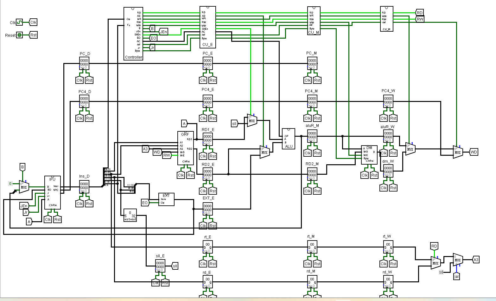
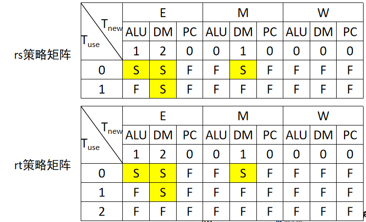

# 设计草稿

先不考虑冲突，进行流水线设计

## alu.v

```Verilog
module alu(
    input [31:0] srcA,//第一个操作数
    input [31:0] srcB,//第二个操作数
    input [3:0] ALUOp,//ALU功能选择
    output [31:0] ALUResult//ALU输出结果
);
```

## controller.v

```Verilog
module controller(
    input [5:0] opCode,
    input [5:0] func,
    output RegDst,//为1时写入寄存器为rd
    output ALUSrc,//为1时将立即数送至ALU
    output MemtoReg,//为1时将内存写入寄存器
    output RegWrite,//为1时需要写GRF
    output MemWrite,//为1时需要写dm
    output Branch,//为1时beq跳转
    output JEn,//为1时j跳转
    output ExtOp,//为1时对imm进行有符号扩展
    output [3:0] ALUOp,//ALU功能选择
    output Jal,//jal跳转
    output Jr,//jr跳转
    output Byte,//为1时按字节存储
    output [1:0] rsTuse,//计算当前指令的rsTuse
    output [1:0] rtTuse,
    output [1:0] Tnew//计算当前指令的Tnew作为初始值传给ID/EX级
);
```

Tuse和Tnew对应表格
|指令|rsTuse|rtTuse|Tnew|
|----|----|----|----|
|add|1|1|1|
|sub|1|1|1|
|ori|1|x|1|
|lui|1|x|1|
|lw|1|x|2|
|sw|1|2|0|
|beq|0|0|0|
|jal|x|x|0|
|jr|0|x|0|

## dm.v

```Verilog
module dm(
    input clk,
    input reset,
    input [31:0] addr,//地址输入
    input WE,//写使能
    input [31:0] WD,//写入数据
    input Byte,//是否按字节读写
    input [31:0] PC,//当前PC输入
    output [31:0] data//读出数据
);
```

## grf.v

```Verilog
module grf(
    input clk,
    input reset,
    input [4:0] A1,//第一个读地址
    input [4:0] A2,//第二个读地址
    input [4:0] A3,//写地址
    input [31:0] WD,//写入数据
    input WE,//写使能
    input [31:0] PC,//当前PC输入
    output [31:0] RD1,//第一个读出数据
    output [31:0] RD2//第二个读出数据
);
```

## ifu.v

```Verilog
module ifu(
    input clk,
    input reset,
    input en,//阻塞PC
    input B,//beq跳转信号且为1时需要跳转
    input [31:0] offset,//beq跳转偏移量
    input J,//j或者jal跳转信号
    input [25:0] index,//j和jal跳转地址
    input Jr,//jr跳转信号
    input [31:0] addr,//jr跳转地址
    output [31:0] instr,//指令输出
    output [31:0] PC8,//当前PC+8输出
    output reg [31:0] PC//当前PC输出
);
```

## splitter

```Verilog
module splitter(
    input [31:0] instr,
    output [5:0] opCode,
    output [4:0] rs,
    output [4:0] rt,
    output [4:0] rd,
    output [5:0] func,
    output [15:0] imm,
    output [25:0] index//j和jal所需index
);
```

## 流水线寄存器设计

```Verilog
module F_D(
    input clk,
    input reset,
    input en,
    input [31:0] PC,
    input [31:0] PC8,
    input [31:0] instr,
    output reg [31:0] PC_D,
    output reg [31:0] PC8_D,
    output reg [31:0] instr_D
);
module D_E(
    input clk,
    input reset,
    input en,
    input ALUSrc,
    input MemtoReg,
    input RegWrite,
    input MemWrite,
    input [3:0] ALUOp,
    input Jal,
    input Byte,
    input [31:0] PC_D,
    input [31:0] PC4_D,
    input [31:0] RD1,
    input [31:0] RD2,
    input [31:0] EXT,
    input [4:0] rs,
    input [4:0] rt,
    input [4:0] A3,
    input [1:0] Tnew,
    output reg ALUSrc_E,
    output reg MemtoReg_E,
    output reg RegWrite_E,
    output reg MemWrite_E,
    output reg [3:0] ALUOp_E,
    output reg Jal_E,
    output reg Byte_E,
    output reg [31:0] PC_E,
    output reg [31:0] PC4_E,
    output reg [31:0] RD1_E,
    output reg [31:0] RD2_E,
    output reg [31:0] EXT_E,
    output reg [4:0] A1_E,
    output reg [4:0] A2_E,
    output reg [4:0] A3_E,
    output reg [1:0] Tnew_E
);
module E_M(
    input clk,
    input reset,
    input en,
    input MemtoReg_E,
    input RegWrite_E,
    input MemWrite_E,
    input Jal_E,
    input Byte_E,
    input [31:0] PC_E,
    input [31:0] PC8_E,
    input [31:0] ALUResult,
    input [31:0] RD2_E,
    input [4:0] A1_E,
    input [4:0] A2_E,
    input [4:0] A3_E,
    input [1:0] Tnew_E,
    output reg MemtoReg_M,
    output reg RegWrite_M,
    output reg MemWrite_M,
    output reg Jal_M,
    output reg Byte_M,
    output reg [31:0] PC_M,
    output reg [31:0] PC8_M,
    output reg [31:0] aluR_M,
    output reg [31:0] RD2_M,
    output reg [4:0] A1_M,
    output reg [4:0] A2_M,
    output reg [4:0] A3_M,
    output reg [1:0] Tnew_M
);
module M_W(
    input clk,
    input reset,
    input en,
    input MemtoReg_M,
    input RegWrite_M,
    input Jal_M,
    input [31:0] PC_M,
    input [31:0] PC8_M,
    input [31:0] aluR_M,
    input [31:0] data,
    input [4:0] A3_M,
    input [1:0] Tnew_M,
    output reg MemtoReg_W,
    output reg RegWrite_W,
    output reg Jal_W,
    output reg [31:0] PC_W,
    output reg [31:0] PC8_W,
    output reg [31:0] aluR_W,
    output reg [31:0] data_W,
    output reg [4:0] A3_W,
    output reg [1:0] Tnew_W
);
```

## 数据通路（不考虑冲突）

  

## 冲突的解决

由于采用的是集中式的译码方式，添加TnewChange模块来计算Tnew的变化，同时在译码时一并译码出指令的Tuse和Tnew，并在每级流水线寄存器中添加Tnew存储端，并使得输入为上一级对应的Tnew，输出为下一级对应Tnew。

增加hazardSolve单元来进行转发和阻塞的控制

## hazardSolve.v

```Verilog
module hazardSolve(
    input [1:0] rsTuse,
    input [1:0] rtTuse,
    input [1:0] Tnew_E,
    input [1:0] Tnew_M,
    input [1:0] Tnew_W,
    input [4:0] rs,//GRF的A1
    input [4:0] rt,//GRF的A2
    input [4:0] A1_E,
    input [4:0] A2_E,
    input [4:0] A3_E,
    input [4:0] A1_M,
    input [4:0] A2_M,
    input [4:0] A3_M,
    input [4:0] A3_W,
    input RegWrite_E,
    input RegWrite_M,
    input RegWrite_W,
    input Jal_M,
    input Jal_W,
    output en_PC,//阻塞时冻结PC
    output en_F,//阻塞时冻结F_D级
    output en_D,
    output en_E,
    output en_M,
    output reset_D,//清空ID/EX级流水线值
    output [1:0] RD1_DSel,
    output [1:0] RD2_DSel,
    output [1:0] srcASel,//srcA转发选择
    output [1:0] srcBSel,//srcB转发选择
    output dmWDSel//dm写入数据转发选择
);
```
  

# 思考题

1. 我们使用提前分支判断的方法尽早产生结果来减少因不确定而带来的开销，但实际上这种方法并非总能提高效率，请从流水线冒险的角度思考其原因并给出一个指令序列的例子。

> 因为如果要在D级得到结果，就必须在D级增加转发电路，否则会因为数据冒险而得到错误的结果，同时也增大了阻塞的可能性，因为这样beq的`Tuse=0`，`Tuse<Tnew`的情况增多，需要阻塞的可能性增大。例如以下指令序列
> `add $1,$1,$1`
> `sub $2,$2,$0`
> `beq $1,$2,a#必须将M级数据转发至D级`
> `nop`
> `add $1,$1,$1`
> `beq $1,$2,a#必须先阻塞一个周期，再将M级数据转发至D级`
> `nop`
> `a:`

2. 因为延迟槽的存在，对于 jal 等需要将指令地址写入寄存器的指令，要写回 PC + 8，请思考为什么这样设计？

> 因为延迟槽的存在，跳转指令的后一条指令一定会被执行，而将指令地址写入寄存器的目的是为了之后能够跳转回原来位置继续执行，如果写会PC+4则跳转回去的时候会将延迟槽中指令重复运行一遍，降低指令执行效率，所以写入PC+8，直接从延迟槽中指令之后开始执行。

3. 我们要求大家所有转发数据都来源于流水寄存器而不能是功能部件（如 DM 、 ALU ），请思考为什么？

> 因为功能部件的输出有延迟，不能在一个时钟周期中就保持稳定的值，而由于有些部件需要输入在一段时间中保持稳定，比如GRF，如果直接转发功能部件的结果，可能导致写入错误的值。

4. 我们为什么要使用 GPR 内部转发？该如何实现？

> 使用GPR内部转发解决D级需要读出的数据在W端还未写入产生的冒险。我的实现方式是将GRF改为下跳沿写入，这样在下半个时钟周期，GRF可以读出正确的数据。

5. 我们转发时数据的需求者和供给者可能来源于哪些位置？共有哪些转发数据通路？

> D级的需求者所需数据可能来源于E级和M级，E级的需求者所需数据可能来源于M级和W级，M级的需求者所需数据可能来源于W级。共有E->D、M->D、M->E、W->E、W->M的转发通路。

6. 在课上测试时，我们需要你现场实现新的指令，对于这些新的指令，你可能需要在原有的数据通路上做哪些扩展或修改？提示：你可以对指令进行分类，思考每一类指令可能修改或扩展哪些位置。

> 对于运算类指令，只需要修改控制器，给出其Tuse和Tnew，在ALU中加入对于运算单元即可；对于有条件跳转类型，要考虑将条件的判断提前到D级，增加对PC的修改通路;对于无条件跳转指令，仿照jal和jr进行修改。

7. 简要描述你的译码器架构，并思考该架构的优势以及不足。

> 我采用的是集中式的译码器，在D级一并译码出所有控制信号和Tuse、Tnew，之后随流水线向前传递。集中式优势是较为简单，添加新的指令只需修改D级的译码器，降低了后续步骤的复杂度；不足主要是会大大增加译码的时间，使整个流水线的性能极大受限于D级译码器速度。

# 测试数据

```mips
a:
jal b
ori $s0,$s0,0x6666
lui $s0,0x5555
sub $t3,$t1,$s0
addi $s0,$0,9
addi $s1,$0,1
addi $t1,$0,0
addi $s2,$0,2
loop_1_begin:
    slt $t4,$t0,$s0
    beq $t4,$0,loop_1_end
    sll $t2,$t0,2
    lui $1,0x0000ffff
    ori $t3,$1,0x0000ffff
    sw $t3,0($t2)
    add $t0,$t0,$s1
    sllv $t2,$t0,$s2
    sub $t3,$t2,$s1
    sw $t3,0($t2)
    addi $t0,$t0,1
    j loop_1_begin
loop_1_end:
ori $2,$2,0x3080
jr $2
nop
b:
addi $t1,$0,100
addi $0,$0,100
sw $t1,0($0)
sw $0,4($0)
add $t2,$t1,$0
ori $t2,$t2,0xabcd
lui $t2,0x8765
sw $t2,8($0)
lw $t3,8($0)
jr $ra
nop
ori $t0,$t0,0xfcfc
lui $t0,0x8f8f
beq $0,$0,c
ori $t1,$t1,100
add $t1,$t0,$t1
c:
sub $t1,$t0,$t1 
sw $t1,0($0)
lw $t2,0($0)
jal d
nop
lui $t2,100
sw $t2,4($0)
jal e
nop
d:
ori $t2,$0,200
lw $0,0($0)
jr $ra
e:
```
