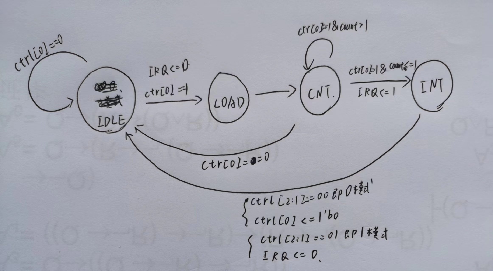

# 设计草稿

## 系统桥设计

```Verilog
module Bridge(
    input [31:0] CPU_addr,   //地址
    input [31:0] CPU_wdata,  //CPU写的数据
    input [3 :0] CPU_byteen, //CPU按字节读写信号
    input [31:0] CPU_m_PC,   //CPU的M级PC
    output [31:0] CPU_rdata, //CPU读到的数据

    input [31:0] DM_rdata,   //DM读出数据
    output [31:0] DM_addr,   //DM读写地址
    output [3 :0] DM_byteen, //DM按字节读写使能
    output [31:0] DM_wdata,  //DM待写入数据
    output [31:0] DM_PC,     //DM所需PC输入

    input [31:0] TC0_rdata,  //TC0寄存器读出数据
    output [31:2] TC0_addr,  //计时器0寄存器地址
    output TC0_we,           //计时器0寄存器写使能
    output [31:0] TC0_wdata, //计时器0待写入数据

    input [31:0] TC1_rdata,  //TC1寄存器读出数据
    output [31:2] TC1_addr,  //计时器1寄存器地址
    output TC1_we,           //计时器1寄存器写使能
    output [31:0] TC1_wdata, //计时器1待写入数据

    output [31:0] Int_addr,  //中断发生器响应地址
    output [3 :0] Int_byteen //中断发生器字节使能信号
);
```

## CP0设计

```Verilog
module CP0(
    input clk,
    input reset,
    input we,               //写使能信号
    input [4 :0] CP0_addr,  //写寄存器地址
    input [31:0] CP0_wdata, //CP0待写入数据
    output [31:0] CP0_rdata,//CP0读出数据

    input [31:0] VPC,       //受害PC
    input BDIn,             //是否是延迟槽指令
    input [4 :0] ExCode,    //异常类型
    input [5 :0] HWInt,     //中断信号输入
    input EXLClr,           //复位EXL
    output [31:0] EPCout,   //EPC的值
    output Req              //进入处理程序的请求
);
```

其中SR、Cause和EPC三个寄存器设计如下：</br>因为只需要用到SR和Cause中的某些位，所以设计为`SR = {16'b0,SR_IM,8'b0,SR_EXL,SR_IE}` 和 `Cause = {Cause_BD,15'b0,Cause_IP,3'b0,Cause_ExCode,2'b0}`，注意Cause_IP每个周期都需要修改

我的设计中，将CP0放在E级，因为在E级已经可以对所有类型的异常进行判断了，并且相比起放在M级，在执行eret时可以很方便的使用转发解决冲突，而不需要阻塞

## 控制器设计

增加mfc0、mtc0、syscall和eret四条指令译码即可，并增加未知指令判断

## ALU设计

增加加法和减法的溢出判断，只需先将两个操作数有符号扩展为33位，求出结果若第33位于第32位不同，则发生溢出

## 中断或异常设计

给PC模块和F\D级、D\E级、E\M级流水线寄存器增加Req控制端，并保证Req优先级高于stall，发生异常时，将PC赋值为0x4180，并清空F\D、D\E、E\M流水线寄存器。

关于eret指令，同样在D级发生跳转，因为没有延迟槽，所以清空F\D级流水线即可，eret指令会与mtc0发生冲突，因为我将CP0放在E级，所以可以不采用阻塞解决冲突，我的解决方案是在NPC模块输入地址前增加转发。

# 思考题

1、请查阅相关资料，说明鼠标和键盘的输入信号是如何被 CPU 知晓的？

> 鼠标和键盘是通过发送中断信号让CPU知晓的，CPU接收中断进入特定的中断处理程序，然后通过系统桥接收键盘和鼠标的输入。

2、请思考为什么我们的 CPU 处理中断异常必须是已经指定好的地址？如果你的 CPU 支持用户自定义入口地址，即处理中断异常的程序由用户提供，其还能提供我们所希望的功能吗？如果可以，请说明这样可能会出现什么问题？否则举例说明。（假设用户提供的中断处理程序合法）

> 因为我们的CPU并没有提供修改异常入口的方法，这样也防止用户将入口设置在不合法的地址产生错误。假设用户提供的中断处理程序合法，自定义的入口地址是可行的，但如果这样，因为不同CPU实现方式不同，程序在不同CPU上的兼容性会出现问题，用户需要了解每个CPU的合法地址范围这也增加了编程难度，使用固定入口屏蔽了CPU内部实现，更有利于编程者。

3、为何与外设通信需要 Bridge？

> 因为CPU能提供的地址只有一个，没办法针对不同的外设提供不同地址，如果增加一个外设就需要修改CPU输出，那样太过麻烦，Bridge使得只需将所有外设编入总地址，由Bridge解析出不同地址提供给外设，这样增加外设只需修改Bridge，简化了CPU设计

4、请阅读官方提供的定时器源代码，阐述两种中断模式的异同，并分别针对每一种模式绘制状态移图。

模式0：计数器倒计时到0时，自动将计数器写使能变为0，并且保持中断信号持续有效，直到计数器写使能为1

模式1：只保持一周期的中断信号，并重新载入计数器初值，再次倒计时

  

5、倘若中断信号流入的时候，在检测宏观 PC 的一级如果是一条空泡（你的 CPU 该级所有信息均为空）指令，此时会发生什么问题？在此例基础上请思考：在 P7 中，清空流水线产生的空泡指令应该保留原指令的哪些信息？

> 会使得EPC写入错误的值，导致进行完异常处理后无法回到原位置。在P7中stall会导致插入空泡，因为stall只在D级发生，所以空泡应该保持D级的PC和BD以及ExCode，即在D\E级流水线寄存器中进行stall时应该保持PC_D,BD_D和EXCode_D,只清空所有的控制信号

6、为什么 jalr 指令为什么不能写成 `jalr $31, $31`？

> 因为当两个寄存器相同时无法产生理想的结果，比如开始31号寄存器中存的是0x3000，jalr这条指令PC为0x3004，指令结束后PC变为0x300c（考虑延迟槽），而并不是我们想要的0x3000，31号寄存器值变为0x300c。我猜测出现这种现象的原因和CPU是流水线有关，因为D级要读31且要写31，此时F级要用到31中的值写入PC，所以可能认为发生了冲突，将PC+8转发给了PC，导致将PC+8写入了，而不是GRF[31]

# 测试方案

基本方法是编写测试数据再和Mar对拍

使用命令行导出中断处理程序到code_int.txt中，主程序导出在code.txt中，稍微修改一下官方tb为即可进行测试

```Verilog
assign i_inst_rdata = (i_inst_addr < 32'h4180) ? 
inst[((i_inst_addr - 32'h3000) >> 2) % 5120] :
inst_int[((i_inst_addr - 32'h4180) >> 2)];

initial begin
    $readmemh("code.txt", inst);
    $readmemh("code_int.txt", inst_int);
    for (i = 0; i < 5120; i = i + 1) data[i] <= 0;
    end
```

测试数据自行编写，先不设置外部中断将所有可能的内部中断测试一遍

```mips
    # 不允许外部中断
    ori $t0, $0, 0x1000
    mtc0 $t0, $12
    # 算术溢出
    lui $t0, 0x7fff
    ori $t0,$t0,0xffff
    lui $t1, 0x7fff
    ori $t1,$t1,0xffff
    addi $t2,$0,-100
    add	$t0,$t0,$t1
    bne $0,$0,end
    addi $t1,$t1,100
    sub $t0,$t0,$t2
    mult $t0,$t1
    mfhi $t0
    add $t0,$t0,$t1#乘除槽阻塞测试
    #取数异常
    lw $t1,1($0)
    lh $t1,1($0)
    lh $t1,0x7f01($0)
    lb $t1,0x7f12($0)
    bne $0,$0,end
    lw $t1,0xff($t1)
    #存数异常
    sw $t1,1($0)#存数地址未 4 字节对齐。
    sh $t1,1($0)#存数地址未 2 字节对齐。
    sh $t1,0x7f01($0)#存 Timer 寄存器的值。
    sb $t1,0x7f12($0)
    sw $t1,0x7f08($0)#向计时器的 Count 寄存器存值。
    bne $0,$0,end
    sw $t1,0xff($t1)#计算地址加法溢出。
    #系统调用
    syscall
    bne $0,$0,end
    syscall
end:
    
.ktext 0x4180
mfc0 $1,$12
mfc0 $1,$13
mfc0 $1,$14
addi $1,$1,4
mtc0 $1,$14 
eret
```

未知指令另外在code中插入ffffffff即可

中断测试

在tb中可通过更改target_pc在宏观PC到达特点值时发出中断，例如现在设置为0x3010

```mips
# 程序首先从这里运行
.text
    # 允许外部中断
    ori $t0, $0, 0x1001
    mtc0 $t0, $12
    lui $t0, 0x7fff
    lui $t1, 0x7fff
    add $t2, $t0, $t1#中断发生位
.ktext 0x4180
sb $0, 0x7f20($0)
eret
```

对于timer可以使用以下方法进行测试

```mips
# 程序首先从这里运行
.text
    # 允许外部中断
    ori $t0, $0, 0x1111
    mtc0 $t0, $12
    addi $t1,$0,2
    sw $t1,0x7f04($0)#初值为2
    addi $t1,$0,9
    sw $t1,0x7f00($0)#启动timer0，模式0
    lui $t0, 0x7fff
    ori $t0,$t0,0xffff
    lui $t1, 0x7fff
    ori $t1,$t1,0xffff
    addi $t2,$0,-100
    add	$t0,$t0,$t1
.ktext 0x4180
mfc0 $1,$12
mfc0 $1,$13
mfc0 $1,$14
addi $1,$1,4
mtc0 $1,$14 
eret
```
