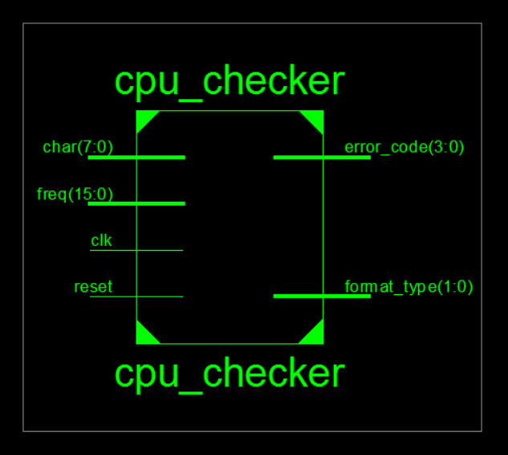

#Challenge：CPU输出合法性检查

###合法性检查

如果输入序列一个后缀的格式满足条件，需要根据规则对当前匹配到的后缀序列的合法性进行检查，**对于不合法但符合格式规范的序列，将序列错误码置位代表不同错误类型。**

回顾上面两种序列的格式：
- **寄存器信息序列：**^\[time]@\[pc]: \$\[grf] <= \[data]\#
- **数据存储器信息序列：**^\[time]@\[pc]: \*\[addr] <= \[data]\#
  
检查规则如下：
- 增加一个模块输入端口freq，表示CPU的仿真周期，**time必须是freq一半的整数倍。（保证周期均为2的正整数次幂）**
- **pc的范围为0x0000_3000 ~ 0x0000_4fff**，且必须字对齐，即**必须为4的整数倍。**
- **addr的范围为0x0000_0000 ~ 0x0000_2fff**，且必须字对齐，即**必须为4的整数倍。**
- **grf的范围为0 ~ 31**，只要数值在该范围内即判为正确（例如，15和0015均合法）。

###顶层模块定义
|端口|方向|位宽|描述|
|----|----|----|----|
|clk|I|1|时钟信号|
|reset|I|1|同步复位信号,将当前状态机状态回归初值并复位输出|
|char|I|8|输入的字符流，以ASCll值表示|
|freq|I|16|CPU仿真周期|
|format_type|O|2|2'b00:格式错误; 2'b01:检测到寄存器信息序列;  2'b10:检测到数据存储信息序列|
|error_code|O|4|该信号为独热码，将相应的位置1代表存在错误。 4'b0000:格式错误或没有合法性问题；  4'b0001：time不合法； 4'b0010：pc不合法；  4'b0100：addr不合法；  4'b1000：grf不合法|

****
##用位运算代替乘法和取模

比如计算a\*10，10的二进制可以写成4'b1010，则a\*10可以写成(a<<3)+(a<<1);

取模运算比如a mod 2^n，就可以等效为a[n-1:0]

##综合结果

  
