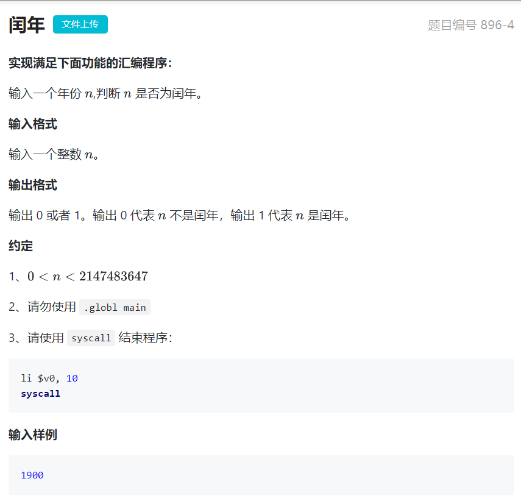
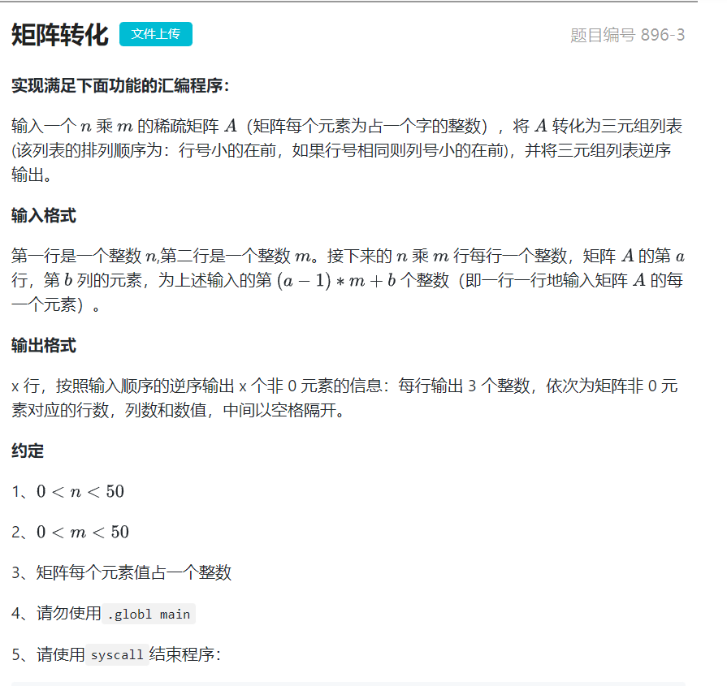
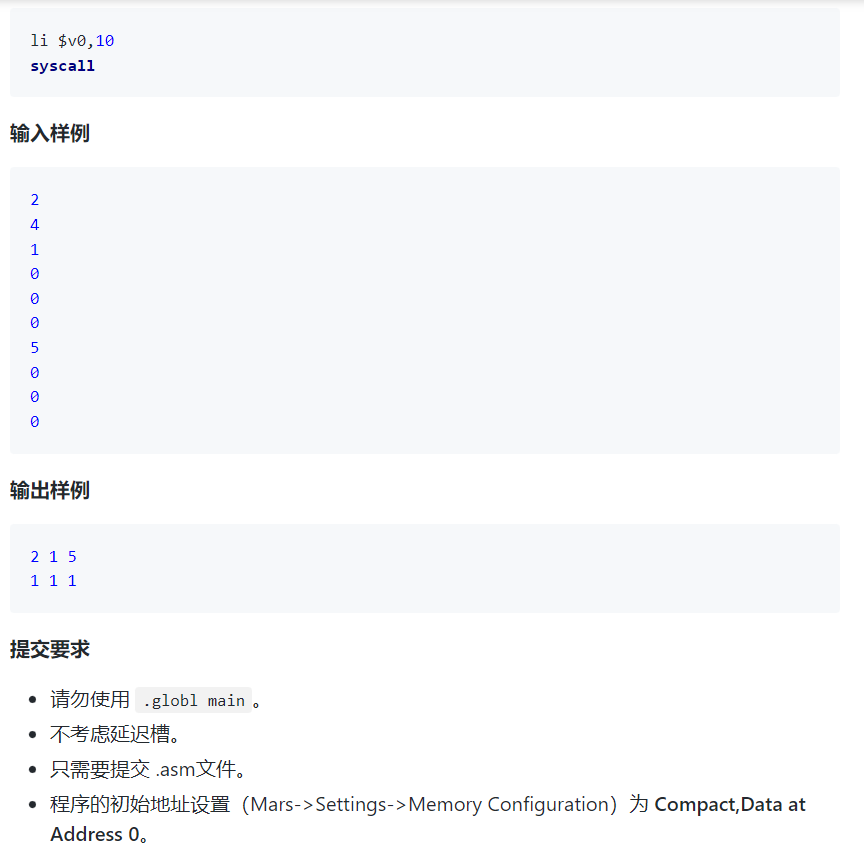
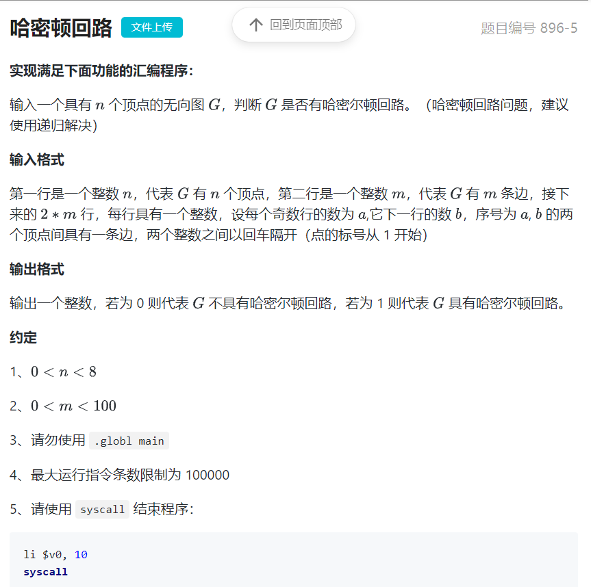
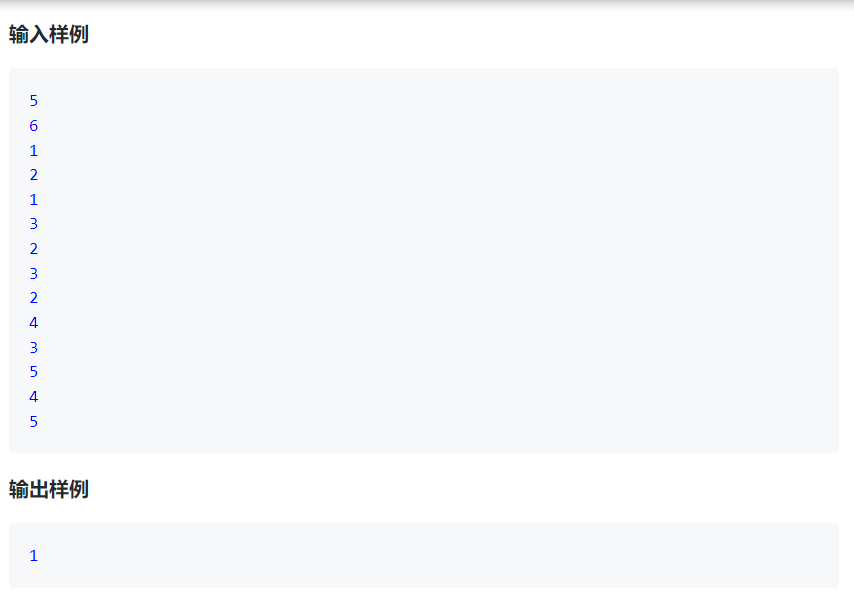
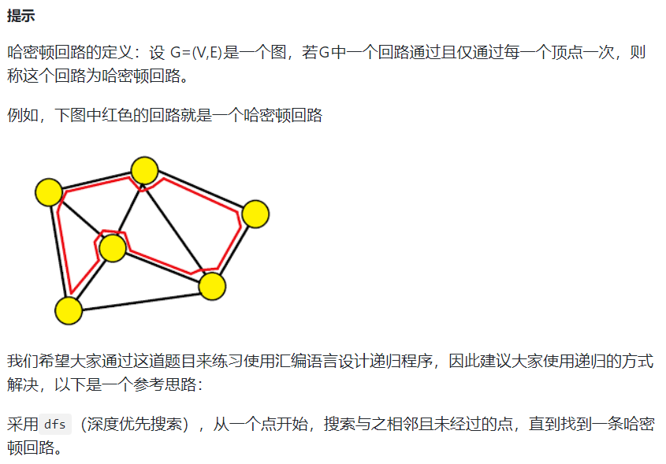

#闰年
  

#矩阵转化
  

  

#哈密顿回路
  

  

  

##参考C代码
```C
#include <stdio.h>
int G[8][8];    // 采用邻接矩阵存储图中的边
int book[8];    // 用于记录每个点是否已经走过
int m, n, ans;

void dfs(int x) {
    book[x] = 1;
    int flag = 1, i;
    // 判断是否经过了所有的点
    for (i = 0; i < n; i++) {
        flag &= book[i];
    }
    // 判断是否形成一条哈密顿回路
    if (flag && G[x][0]) {
        ans = 1;
        return;
    }
    // 搜索与之相邻且未经过的边
    for (i = 0; i < n; i++) {
        if (!book[i] && G[x][i]) {
            dfs(i);
        }
    }
    book[x] = 0;
}

int main() {
    scanf("%d%d", &n, &m);
    int i, x, y;
    for (i = 0; i < m; i++) {
        scanf("%d%d", &x, &y);
        G[x - 1][y - 1] = 1;
        G[y - 1][x - 1] = 1;
    }
    // 从第0个点（编号为1）开始深搜
    dfs(0);
    printf("%d", ans);
    return 0;
}
```