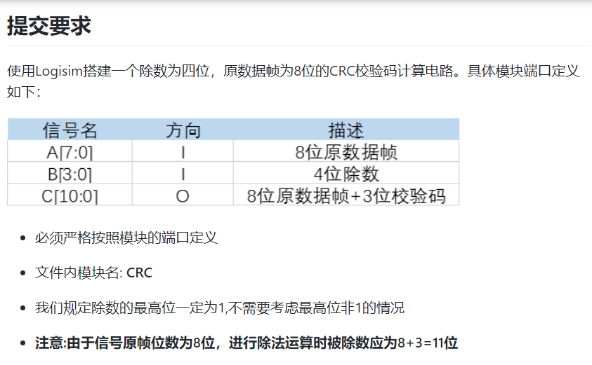
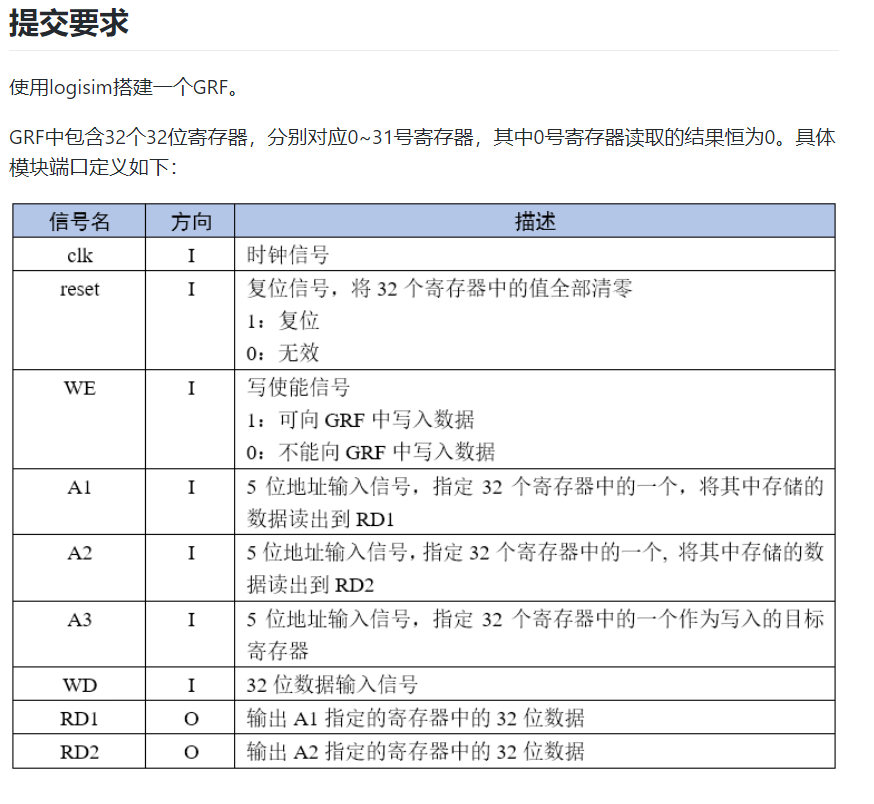
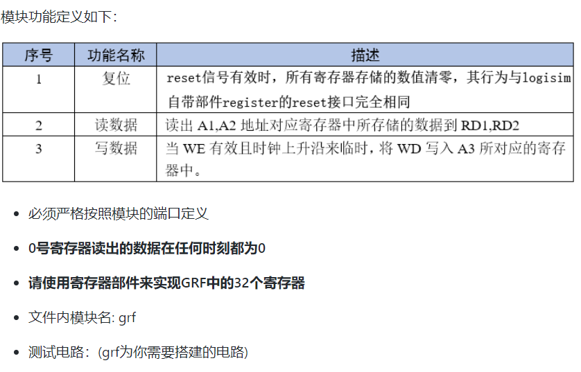
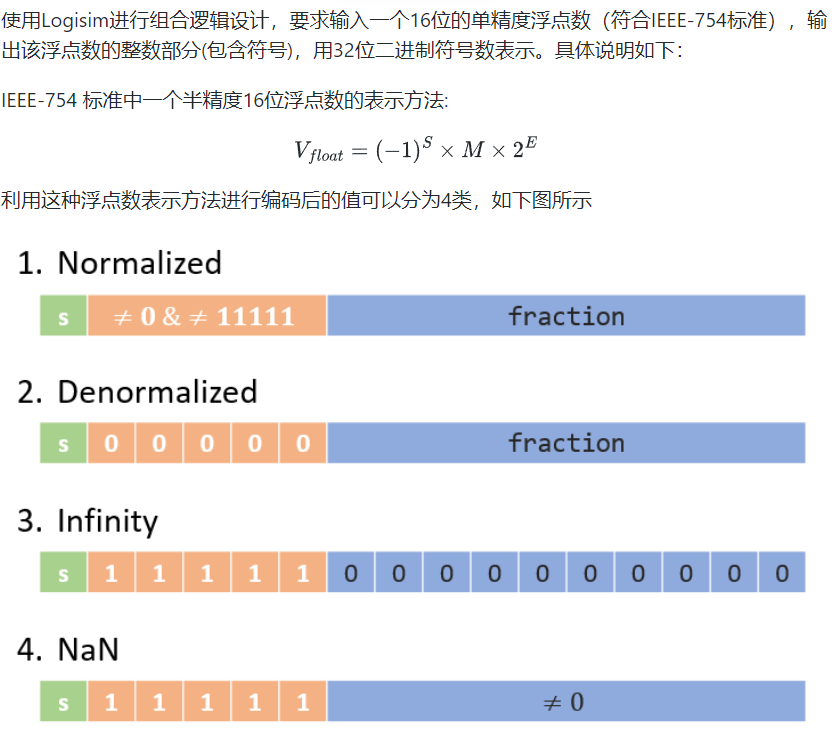
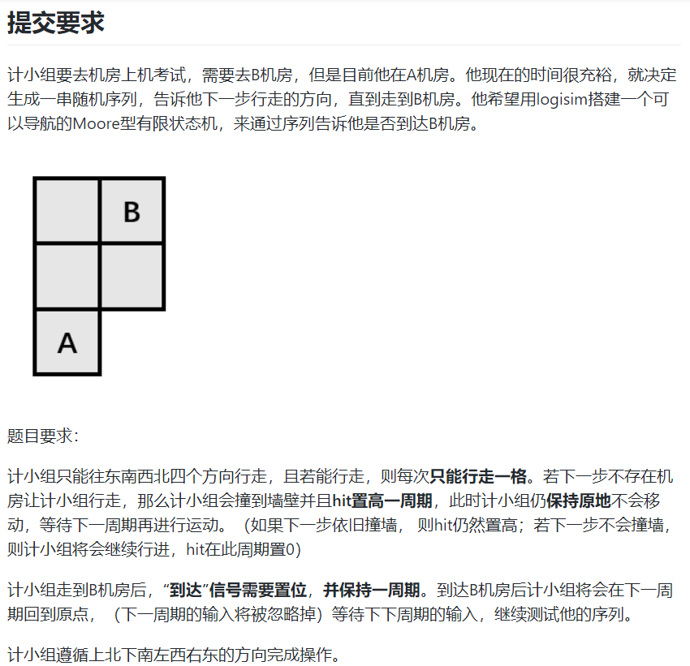
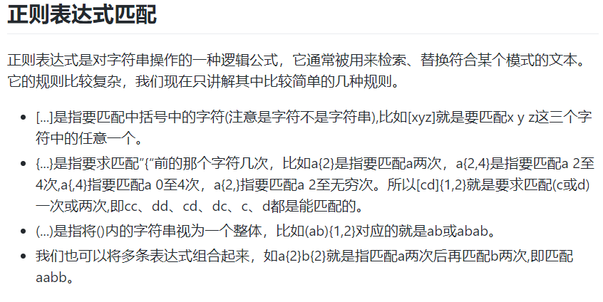

# CRC校验

  

# GRF

  

  

# ftoi（附加题）

  

  

  

## 思路
此题看似复杂，但实际上分析过后，只有Normalized情况下整数部分才大于0，要注意E的计算过程中，exponent-011111为无符号减，最大值只有8，所以不用担心左移溢出。解决无符号减法，我采用的是异或后取反的方法。

# navigation

  

  

## 思路
为了避免过多的状态，我将其分两部分，一部分为位置状态，另一部分为撞墙判断，通过比较前后两个位置状态是否相等来判断是否撞墙。

# fsm

  

  

  

**注意Mealy和Moore的区别**